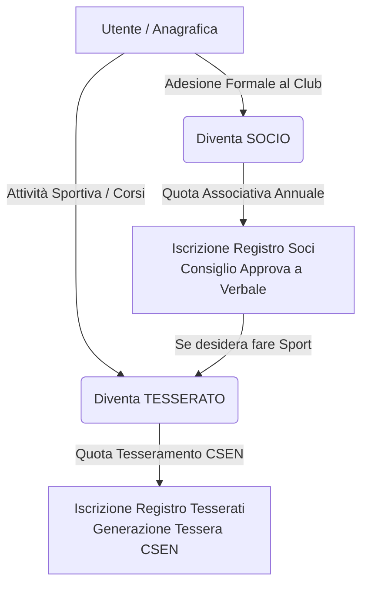

# Logiche di Sistema: Socio vs Tesserato

Questo documento descrive le regole di business e i flussi interni del portale Adrenalina Club per la gestione dei ruoli **Socio** e **Tesserato**.

---

## 1. Definizione dei Ruoli

*   **SOCIO**:
    *   Effettua l'adesione formale all'associazione culturale/sportiva.
    *   Paga la **Quota Associativa Annuale** (gestita in `registro_soci.quota_scadenza`).
    *   Viene iscritto nel registro soci dopo la delibera e firma del verbale del Consiglio Direttivo.
    *   **Non ha abilitazione all'attività sportiva automatica** e non riceve una tessera CSEN per il solo fatto di essere socio.
    *   Può partecipare alle assemblee sociali ed eventi associativi non sportivi.

*   **TESSERATO**:
    *   Viene inserito nel `registro_tesserati` con una richiesta di tesseramento sportivo.
    *   Riceve una **Tessera CSEN** e relativa copertura assicurativa.
    *   Paga la quota del tesseramento CSEN.
    *   Può partecipare ai corsi sportivi (es. Calisthenics, Strongman) previa validità del **Certificato Medico**.
    *   Paga la quota del corso (mensile, trimestrale, ecc.) con una specifica data di inizio e di fine corso.
    *   Non è necessariamente un Socio (può essere un "Tesserato Esterno" che partecipa solo alle attività sportive).

---

## 2. Flusso di Interazione

Un utente può accumulare entrambi i ruoli (Socio e Tesserato). Per frequentare attività sportive, un Socio **deve** tesserarsi.

---

## 3. Gestione Scadenze Corsi

*   In fase di iscrizione, l'atleta indica la **Data Inizio Corso**. Questa non può essere antecedente alla data di richiesta del suo tesseramento (`registro_tesserati.data_richiesta_tesseramento`).
*   La **Data Scadenza Corso** viene calcolata sommando i mesi previsti dal piano di abbonamento (es. +3 mesi per un trimestrale) e impostando come giorno di scadenza il giorno precedente (es. inizio 12 Gennaio -> scadenza 11 Aprile).
*   L'istruttore ha facoltà di sovrascrivere manualmente la data di scadenza del corso per un atleta. In tal caso, viene mostrato il simbolo **✋ (Manina)** a indicare la forzatura manuale.
