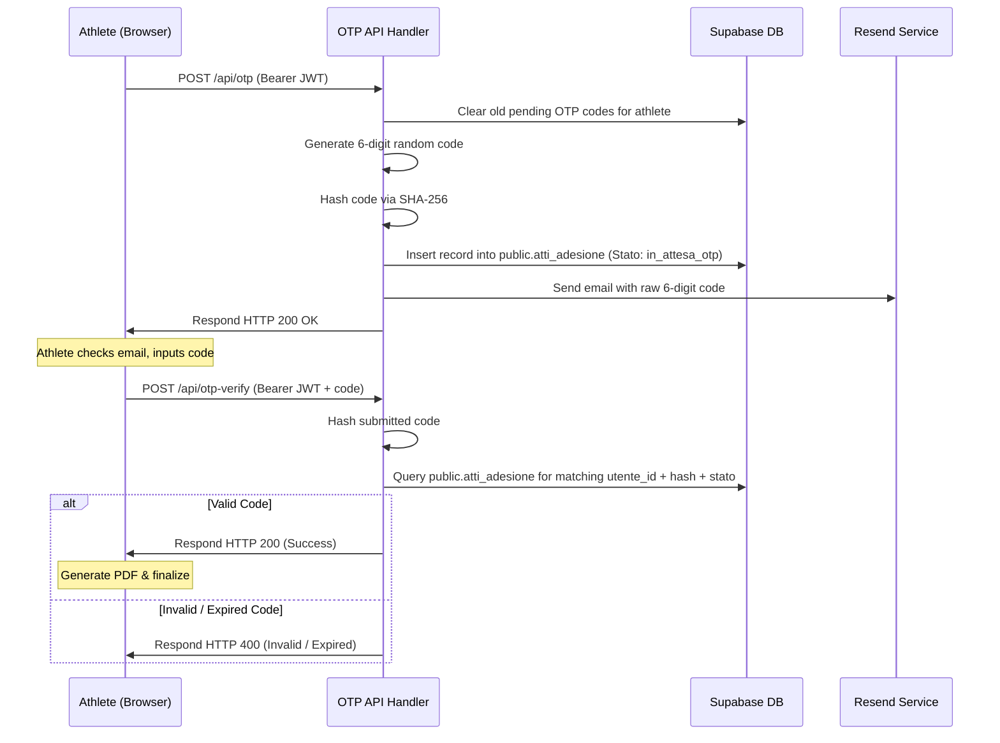

# OTP Signature System

Adrenalina Club uses a paperless electronic signature system backed by One-Time Passwords (OTP) sent to the athlete's email address. This ensures document validation without manual paper prints or signatures.

---

## 🔁 Signature Lifecycle Flow

---

## 🔒 Security Practices

1.  **JWT Verification**: Both OTP generation and validation require a valid JWT passed in the request Authorization headers, checked directly via Supabase Auth (`supabase.auth.getUser()`).
2.  **Cryptographic Hashing**: Raw OTP codes are never saved in the database. Instead, they are hashed using SHA-256:
    -   *Serverless API*: Done using Deno/Web Crypto APIs (`crypto.subtle.digest('SHA-256')`) and Node `crypto.createHash('sha256')`.
3.  **State Isolation**: Database updates use the Supabase `service_role` client to bypass Row-Level Security constraints while writing, but verify matching User IDs securely.
4.  **Automatic TTL**: Codes expire within 2 minutes of generation. Active table cleanup occurs on new requests, removing old unverified keys.
