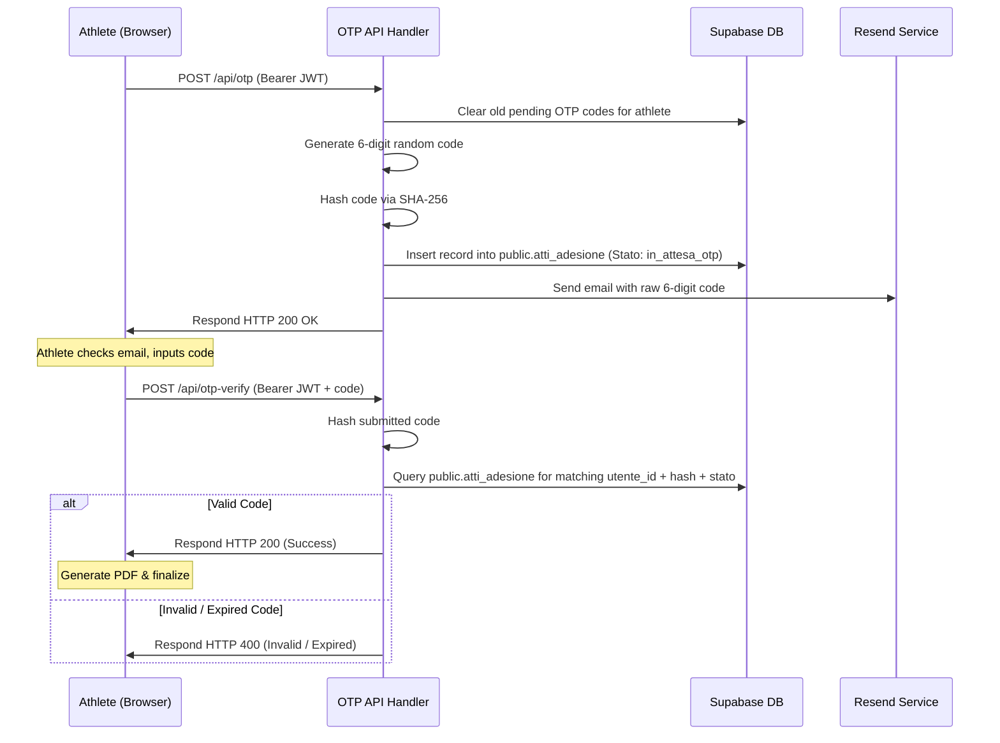

# OTP Signature System

Adrenalina Club uses a paperless electronic signature system backed by One-Time Passwords (OTP) sent to the athlete's email address. This ensures document validation without manual paper prints or signatures.

---

## 🔁 Signature Lifecycle Flow

---

## 🔒 Security & Performance Practices

1.  **Fast-First Pre-Upload Strategy (v1.03.49/50)**: Heavy operations (document compression, PDFLib page merging, and storage bucket uploads) execute during the "Invia Codice OTP" request. This ensures that the final signature confirmation (`/api/otp-verify.js`) finishes in under 2 seconds without network timeout vulnerabilities on mobile 4G/5G connections.
2.  **Extended Signed URL Lifetime**: Storage signed URLs for pre-uploaded files (`documenti_identita`, `certificati_medici`, `documenti_adesione`, `documenti_tutori`) use a duration of **3600 seconds (1 hour)**, eliminating link expiration risks while athletes read their OTP email.
3.  **Proactive JWT Refresh**: Prior to issuing the `/api/otp-verify.js` request, the client automatically triggers `supabaseClient.auth.refreshSession()` to renew the session token and prevent `401 Unauthorized` responses caused by delayed user inputs.
4.  **OTP Hash Audit Trail on Contract PDF**: Upon entering the valid 6-digit OTP, the client calculates `sha256(code)` and updates the contract PDF (`adesione.pdf`) in ~150ms before calling the verification endpoint, embedding `OTP VERIFICATION TOKEN HASH: <hash>` into the official document archive.
5.  **JWT Verification**: Both OTP generation and validation require a valid JWT passed in the request Authorization headers, checked directly via Supabase Auth (`supabase.auth.getUser()`).
6.  **Cryptographic Hashing**: Raw OTP codes are never saved in the database. Instead, they are hashed using SHA-256:
    -   *Serverless API*: Done using Deno/Web Crypto APIs (`crypto.subtle.digest('SHA-256')`) and Node `crypto.createHash('sha256')`.
7.  **State Isolation**: Database updates use the Supabase `service_role` client to bypass Row-Level Security constraints while writing, but verify matching User IDs securely.
8.  **Automatic TTL**: Codes expire within 15 minutes of generation. Active table cleanup occurs on new requests, removing old unverified keys.
