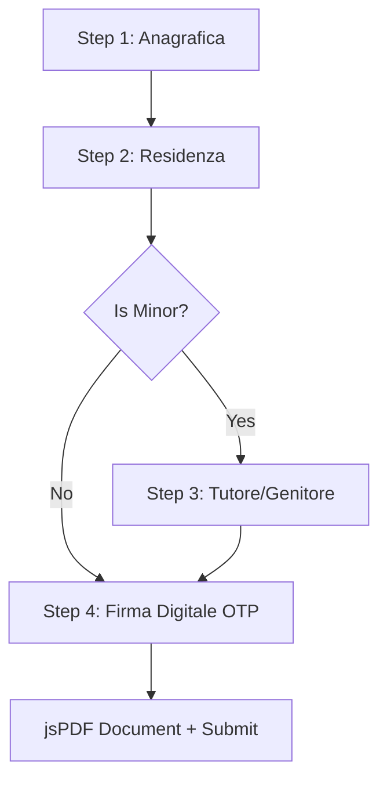

# Registration Flow: Athlete Portal

The registration wizard is implemented in [registrazione.html](../portal/registrazione.html). It provides a secure, four-step onboarding funnel for incoming athletes joining Adrenalina Club.

---

## 🗺️ Step Funnel Breakdown

### 1. Passo 1: Anagrafica (Personal Info)
-   Captures basic personal information (name, surname, fiscal code, birthdate, birth location).
-   Requires selection of the **Adesione (Membership type)**:
    -   *Tesserato*: Course licensing only. Requires a medical certificate.
    -   *Socio + Tesserato*: Full association membership + course licensing. Requires a medical certificate.
    -   *Socio*: Association membership only. Medical certificate is optional.
-   Requires selection of **Tessera Sportiva (Sport License)** (Silver, Gold, Integrativa A/B) if tesseramento is chosen.
-   Calculates fees dynamically.

### 2. Passo 2: Residenza (Address)
-   Captures residential address details.
-   Integrates a dynamic Italian municipality selector.

### 3. Passo 3: Tutore/Genitore (Parental Signoff)
-   Dynamically shown only if the calculated birthdate is under 18 years old.
-   Requires inputs for parental/guardian details (name, fiscal code, email).

### 4. Passo 4: Firma Digitale (OTP Electronic Signature & Pre-Upload)
-   Accepts legal waivers and terms.
-   Richiede il consenso GDPR obbligatorio sul trattamento dei dati sanitari e l'elaborazione automatizzata AI per i tesserati.
-   **Pre-Upload Strategy (v1.03.49/50, Hardening v1.04.71)**: Al click su *"INVIA CODICE OTP"*, il sistema esegue preventivamente la compressione delle immagini, l'unione PDFLib fronte/retro protetta da fallback su formati non standard, la generazione del contratto ed il caricamento su Storage (`documenti_identita`, `certificati_medici`, `documenti_adesione`, `documenti_tutori`) con `upsert: false` e policy RLS dedicate per utente, generando Signed URL con durata di **3600 secondi (1 ora)**.
-   **Verifica Istantanea (< 2s)**: Al click su *"CONFERMA FIRMA"*, l'OTP viene inviato a `/api/otp-verify.js` in meno di 2 secondi, previa sanitizzazione degli spazi (`.replace(/\s+/g, '')`) e refresh preventivo della sessione JWT (`auth.refreshSession()`).
-   Generates and validates OTP code to e-sign the registration dynamically.

---

## 🔒 Gated Onboarding & Controllo Certificati (Flusso Ibrido AI)

Per i nuovi tesserati (casistica `tesserato` e `socio_tesserato`), l'iscrizione segue una logica condizionale di sicurezza per evitare ingressi senza adempimenti sanitari:

1. **Registrazione (Stato PENDING)**: L'atleta completa la firma digitale e carica il certificato medico, inserendo data di emissione e tipologia.
2. **Validazione AI (Semaforo)**:
   - **VERDE**: Certificato valido e corrispondente. Si sblocca immediatamente il link di pagamento.
   - **ROSSO**: Rifiutato. L'utente riceve un alert e deve ricaricare un documento leggibile/conforme nel portale.
   - **GIALLO**: Richiesta revisione manuale. Il certificato finisce nella coda del Presidente che delibera in un click.
3. **Pagamento (Attivazione)**: Solo con il certificato validato (VERDE) l'utente può procedere al pagamento tramite Stripe. All'avvenuto saldo, il tesseramento diventa `ATTIVO`.

---

## 🧠 Smart Client-Side Validations & Layout Rules

1.  **Default Layout Documenti "Due File Separati" (v1.03.49)**: La modalità predefinita per il caricamento del documento d'identità è impostata su "HO DUE FILE SEPARATI" rendendo visibili sia la casella Fronte che Retro per evitare che gli utenti mobile caricino solo il retro (causando blocchi AI o stati GIALLO non necessari).
2.  **Avviso Modalità File Unico**: In modalità "HO UN FILE UNICO", viene mostrato un avviso visivo dedicato (`#avviso-single-mode`) che ricorda di caricare entrambe le facce.
3.  **Tastiera Numerica ed Autocompletamento Mobile**: L'input `#otp_code` include gli attributi `inputmode="numeric" pattern="[0-9]*" autocomplete="one-time-code"` per attivare la tastiera numerica ed il rilevamento automatico del codice OTP da SMS/email su iOS e Android.
4.  **Italian Codice Fiscale Algorithm**: Validates Italian tax code formatting and check character checksums.
5.  **Cascading Municipality Selection**: Fetches Italian municipalities directly from an open-source dataset, automatically populating and filtering Province, Commune, and ZIP/CAP codes based on selection.
6.  **Dynamic Age Calculations**: Parses the birthdate input, comparing it to current time to flag minor status and display the parental guardian input step (Step 3).
7.  **Medical Certificate Emission Date Validation**: Ensures the medical certificate emission date entered by the user is not in the future relative to the registration date (v1.03.26).
8.  **Browser Credential Autofill Prevention**: Form inputs use `autocomplete="off"` for email and `autocomplete="new-password"` for password to prevent modern browsers from pre-filling fields with administrative/President credentials during new registration sessions (v1.03.26).
9.  **Storicizzazione vs Cleanup Incompleti**: Come chiarito dalle regole operative del progetto, la *EPIKA CORE RULE* (storicizzazione distruttiva via `attivo` / `data_fine`) si applica **SOLO a soggetti che hanno superato la fase di registrazione**. Per le registrazioni mai completate o abbandonate prima della firma OTP, è consentita l'eliminazione fisica diretta senza traccia storica.

